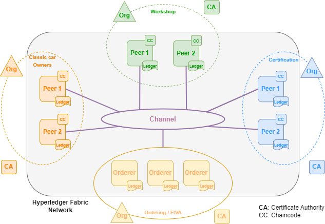

# ClassicsChain - Trustworthy Classic Cars History
ClassicsChain consists of a blockchain-based application specially tailored to record every relevant information about classic cars. This encompasses technical specifications, evidence of restoration procedures, certificates, details of current and past owners, and any other crucial documentation necessary for achieving the highest degree of detail possible for a classic vehicle. \textit{ClassicsChain} leverages a Hyperledger Fabric blockchain network, with the functions available on our smart contracts accessible through a Fabric application functioning as our server application. This application was also integrated with IPFS media storage, to store the media evidence to associate with vintage cars. This was a project resulted from a master's dissertation.

Please refer to this [link](https://youtu.be/OneQtXx7c9w) to a demonstration video of this Web Application.

## Repository content

> Api&Application: Contains the code for the Fabric application (application that interacts with an Hyperledger Fabric blockchain network deployed using Kuberentes and Hyperledger Fabric Operator) and API

> Chaincode: Smart contract's code deployed on the Fabric network

> ClientApp: Front-end client application, developed with Angular

> LocalAndTesting: Earlier versions of the solution and local deployment files

> Tests: Performance tests executed to our solution

## Architecture

> Deployment Diagram


> Hyperledger Fabric Network topology



## Local Deployment

### Pre-requisites
- Having Ubuntu 20.04 installed on your machine to be able to run the deployment scripts
- Having Hyperledger binaries installed and configuration files in your machine
- Having node.js installed to run the Fabric and front-end applications
- Attention: the local deployment is not completely equal to our own and the versions of the smart contracts and applications are not the same as ours (these are older versions)

### Hyperledger Fabric Network Deployment
Inside the NetworkScripts folder, run the following commands (this will instatiate a operational local test network that mirrors our own with our chaincode):

```bash
./startFabric.sh classicCars
#This will take a while depending on your machine

#If you want to stop the network run:
./networkDown.sh
```

### Fabric Application Deployment

Inside the App&API folder, run the following commands:

```bash
npm install
#This will install all necessary dependencies

npm run dev
#This will instantiate a fabric application as well as the API (you can test it using postman)
#This command will fail if the Fabric network network is not previsouly deployed

#You can access the API via:
#http://localhost:8393
```

### Front-end Application Deployment
Inside the FrontEnd/ui folder, run the following commands:

```bash
npm install
#This will install all necessary dependencies

npm start
#This will instantiate our front

#You can access the front-end app via:
#http://localhost:4200/
```
